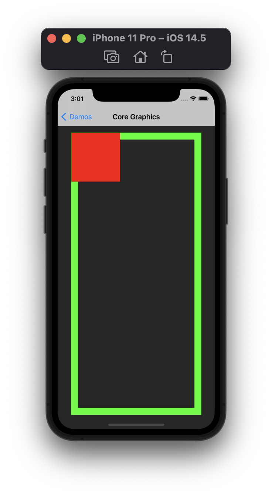

# UIGraphicsImageRenderer

CoreGraphics can create an image using **[UIGraphicsImageRenderer](https://developer.apple.com/documentation/uikit/uigraphicsimagerenderer)**. It can return multiple type like UIImage, JPEG, PNG Data objects.

* Image Renderer keeps a cache of Core Graphics Context so reusing it is advisable.

<br />  

## Sample Codes  
---
### Creating an image using Image Renderer:
You can create an image by using **UIGraphicsImageRenderer** method 
```
func image(actions: (UIGraphicsImageRendererContext) -> Void) -> UIImage
```
```
class func image(with size: CGSize) -> UIImage {
    let renderer = UIGraphicsImageRenderer(size: size)

    let image = renderer.image { context in
        // Set stroke info
        UIColor.green.setStroke()
        context.cgContext.setLineWidth(20)
        context.stroke(renderer.format.bounds)

        // Set fill info
        UIColor.red.setFill()
        context.fill(CGRect(x: 1, y: 1, width: 140, height: 140))
    }

    return image
}
```

  

-----
### Using blend modes

You can specify blend mode when setting fill or stroke to produce a blending effect.
```
class func imageWithBlendMode(with size: CGSize) -> UIImage {
    let renderer = UIGraphicsImageRenderer(size: size)

    let image = renderer.image { context in
        UIColor(red: 158/255, green: 215/255, blue: 245/255, alpha: 1).setFill()
        context.fill(CGRect(x: 0, y: 0, width: 140, height: 140))

        UIColor(red: 145/255, green: 211/255, blue: 205/255, alpha: 1).setFill()
        context.fill(CGRect(x: 70, y: 70, width: 140, height: 140), blendMode: .lighten)
    }

    return image
}
```

  

-----  
<br />
### Core Graphics Rendering Functions

You can use the Core Graphics **CGContext** through **UIGraphicsImageRenderer**. That way you can produce Core Graphics rendering functions directly.

```
class func imageWithCGContext(with size: CGSize) -> UIImage {
    let renderer = UIGraphicsImageRenderer(size: size)

    let image = renderer.image { context in
        UIColor.blue.setFill()
        context.fill(CGRect(x: 0, y: 0, width: 200, height: 200))

        UIColor.red.withAlphaComponent(0.7).setFill()
        context.cgContext.fillEllipse(in: CGRect(x: 0, y: 0, width: 200, height: 200))
    }

    return image
}
```
  

-----  